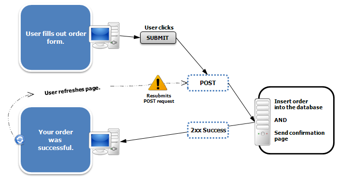
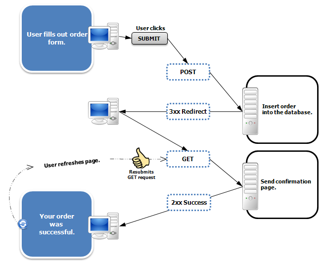

- # Problem
	- Formulardaten werden mehrfach gesendet
	- Der Nutzer schickt seine Formulardaten und klickt danach auf _Neu Laden_ im Browser => Daten werden erneut gesendet
	- 
- # Lösung
	- **PRG Pattern** (POST, Redirect, GET)
	- 
	-
	- Man leitet den Browser auf eine Anzeige-Seite um (**Redirect**) und lässt ihn nicht auf der Form-Ziel-Seite
	- ```java
	  reponse.redirect("...")
	  ```
	-