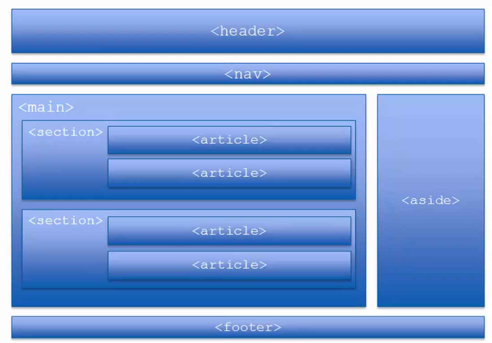

- ## Block Elemente
	- ```html
	  <body>
	    <h1> Das ist eine Überschrift </h1>
	    <p> Das ist ein Paragraph, er wird entsprechend formatiert </p>
	    <p> Hier dürfen keine weiteren Blockerzeugenden Elemente vorkommen </p>
	  </body>
	  ```
- ## Strukturelemente
	- Sturkturelemente sind wichtig für die **Übersichtlichkeit** des HTML codes und vor allem für **die Accessibility** (z.B. für Screen Reader für Sehbehinderte). Auch _Web Crawler_ können sich besser zurechtfinden.
	- Sie sind statt `<div></div>` zu verwenden wo es möglich ist
	- Keine Auswirkungen auf Darstellung der Elemente auf der Webseite
	- ```html
	  <header></header>
	  <nav></nav>
	  <main></main>
	  <section></section>
	  <aside></aside>
	  <article></article>
	  <footer></footer>
	  ```
	- 
- ## Fluss Elemente
	- {{embed [[HTML Listen]]}}
	- {{embed [[HTML Tabellen]]}}
- ## TODO Interaktive Elemente
- ## TODO Einbindende Elemente
- ## TODO Stil Elemente
- ## TODO Metadaten