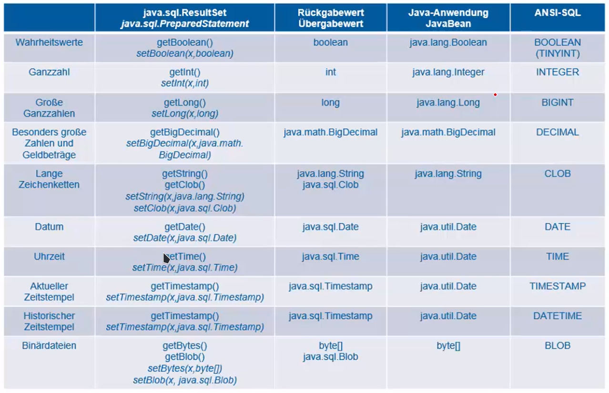
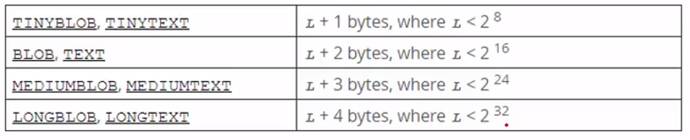

- # Allgemeines
	- Java Database Connectivity ist eine **einheitliche Programmierschnittstelle** für relationale Datenbanken.
	- Die Implementierung liefert der Treiber der Datenbankhersteller.
	- Quelltext ist portierbar => Quelltext funktioniert mit allen relationalen Datenbanken, die einen Treiber bereitstellen.
	- **Low-Level** => Direkter Zugriff auf die Datenbanken, kein Persistenz-Framework
- # Datentypen
	- 
	- 
	  id:: 62684af0-fd0f-446b-9fac-ce0ffc6446cb
- # JDBC im JEE Server
	- Die Verbindungen werden automatisch durch _Connection Pools_ verwaltet.
	- Die Connection wird durch eine CDI (Context and Dependency Injection) in den eigenen Code injeziert.
		- ```java
		  public class DbManager {
		    @Resource(lookup="...")
		    private DataSource datasource;
		    
		    public void fetch() {
		      try (Connection connection = datasource.getConnection()) {
		        PreparedStatement ps = connection.prepareStatement();
		        ResultSet result = ps.executeQuery();
		      } catch (Exception e) {
		        ...
		      }
		    }
		  }
		  ```