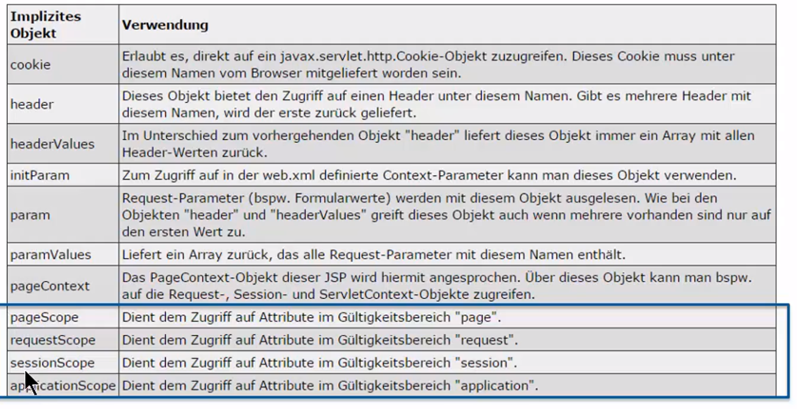

- # Allgemeines
	- Sprache, die in [[JSP]] verwendet werden kann, um JavaCode zu vermeiden.
- # Zugriff auf Beans
	- ```jsp
	  ${customer.email}
	  ${customer["email"]}
	  ${item1.preis + item2.preis}
	  ${not empty item1.preis ? item1.preis : item2.preis}
	  ```
	- Die Bean `customer` wird automatisch gefunden, dabei werden alle Scopes durchsucht.
	- Wenn die Bean nicht gefunden werden kann, bleibt diese Stelle leer.
	- ## Implizite Objekte
		- 
-