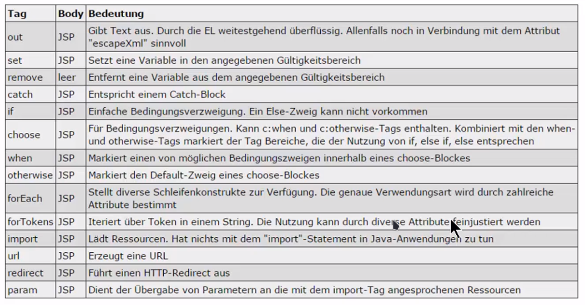

- Java Standard Tag Library
- # Allgemeines
	- Gestaltung von [[JSP]]s frei von Java-Code
	- Darstellungslogik, Formatierungen, Iterationen über Arrays und Listen, Verzweigungen
	- Aus dem Jahr 2002
- # Teile
	- `core` => Basistags zum Programmablauf
	- `fmt` => Formatierung von Datums-, Währungs- und Zahlenwerten
	- `functions` => Manipulation von Zeichenketten und Array
	- `sql` => für Datenbankzugriffe
	- `xml` => Verarbeitung von XML
- # Beispiel
	- ```jsp
	  <%@ taglib prefix="c" uri="http://java.sun.com/jsp/jstl/core"%>
	  <!-- for each loop -->
	  <c:forEach items="${items}" var="element">
	    ${element}
	  </c:forEach>
	  
	  <!-- if without else -->
	  <c:if test="${empty customer}">
	  </c:if>
	  
	  <!-- if with else (=choose) -->
	  <c:choose>
	    <c:when test="...">
	    </c:when>
	    
	    <c:otherwise>
	    </c:otherwise>
	  </c:choose>
	  ```
	- 