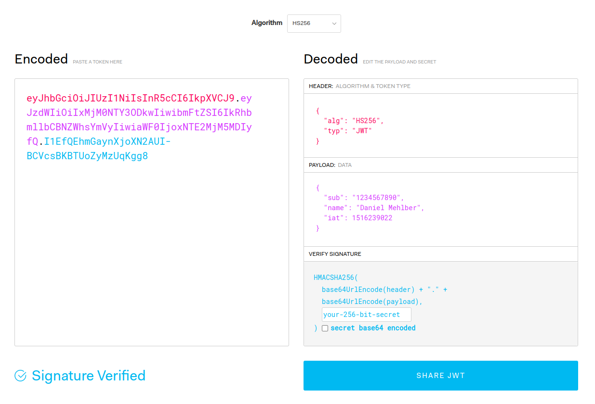

- # Nutzen und Anwendungszweck
- Eine gängige Methode für **Authorisierung** und **Informationsaustausch**, die **nur** sicherstellt, dass die ^^gesendete Information nicht manipuliert^^ (z.B. abgefangen und verändert wurde).
	- Authorisierung => JWT Token enthällt **Key**
	- Informationsaustausch => JWT Token enthällt Information
- WICHTIG: ^^Es erfolgt **keine Verschlüsselung**, sondern nur **eine Signierung**^^
	- Geheimnisse sind im Token **nicht sicher** (Base64 kann einfach umgekehrt werden)
	- Die Signierung mithilfe eines Geheimnisses lässt eine Überprüfung auf Manipulation zu
	- Die Nachricht muss **zusätzlich mit z.B. SSL** (in HTTPs) verschlüsselt werden
- # Aufbau
- 
- Die Hauptbestandteile sind
	- **Header** => Token Type (JWT) und verwendeter _Signing Algorithm_ in **Base64** enkodiert
	- **Payload** => _Claims_ (=Aussagen über _Entitäten_, wie z.B. Nutzer) in **Base64** enkodiert
		- **_iss_** = Issuer = Austeller des Tokens
		- **_exp_** = Expiration Time
		- **_sub_** = Subject (Wo gelten die _Claims_?)
		- oder auch **eigene _Claims_** (=_Public Claims_ oder _Private Claims_)
		- ^^WICHTIG: Durch die Base64 enkodierung ist die Payload nicht sicher^^ => Keine Geheimnisse in der Payload
	- **Signature** => $$SignAlg(Encoded Header + Encoded Payload + Secret) = Signatur$$
		- **_Signatur_** => Ermöglicht Prüfung, ob Token nach Absenden "_verändert_" wurde.
		- **_Secret_** => Muss vom _Issuer_ ausgewählt werden und **geheim** bleiben (Teil der Signatur)
- # Anwendung
- Im Normalfall enthält der JWT einen **Session-Token** im Payload
- Der JWT wird mit dem `Authorization: Bearer <token>` HTTP-Header versendet