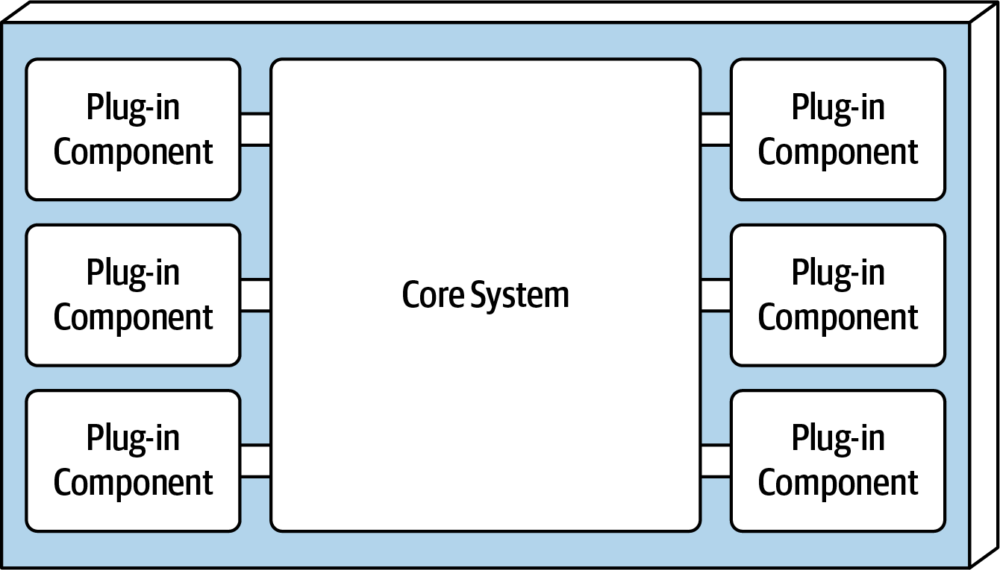

- # Architektur
	- Die Architektur sieht einen **kleinen Kern** vor, der durch verschiedene **Plug-In-Komponenten** erweitert wird.
	- {:height 403, :width 673}
	- Die Verknüpfung zu den Komponenten können direkt (über Methodenaufrufe) oder über andere Schnittstellen wie z.B. REST oder Messaging geschehen.
	- Die Plug-Ins werden in einer **Plug-In-Registry** hinterlegt, sodass sie geladen werden können.
- # Bibliotheken und Frameworks
	- OSGi (Open Source Gateway Initiative) in Java
	- Penrose in Java
	- Jigsaw in Java
	- Prism in .NET